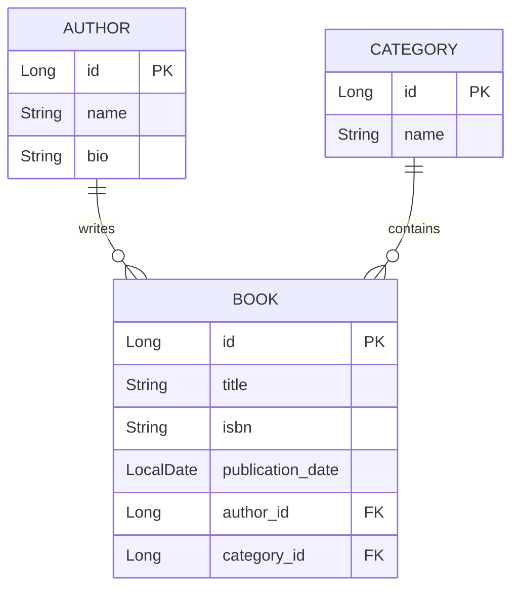

### CRUD Library API

#### Descrição

Este projeto é uma aplicação básica de CRUD (Create, Read, Update, Delete) para gerenciar a coleção de autores, livros e categorias de uma biblioteca. É construído usando Java e Spring Boot, e utiliza JPA para persistência de dados.

#### Funcionalidades

- **Gerenciamento de Autores**: Criar, recuperar, atualizar e deletar autores.
- **Gerenciamento de Livros**: Criar, recuperar, atualizar e deletar livros.
- **Gerenciamento de Categorias**: Criar, recuperar, atualizar e deletar categorias.

#### Estrutura do Projeto

O projeto está estruturado em vários pacotes:

- **controller**: Contém os controladores REST para lidar com as requisições HTTP.
- **model**: Contém as entidades JPA que representam as tabelas no banco de dados.
- **repository**: Contém os repositórios JPA para interagir com o banco de dados.
- **service**: Contém a lógica de negócio e os serviços que lidam com as operações de CRUD.
- **exception**: Contém classes de exceção personalizadas para o projeto.

#### Diagrama de Relacionamento das Tabelas

#### Endpoints

##### Author Controller

- `POST /api/authors`: Cria um novo autor.
- `GET /api/authors`: Recupera todos os autores.
- `GET /api/authors/{id}`: Recupera um autor pelo ID.
- `PUT /api/authors/{id}`: Atualiza um autor existente pelo ID.
- `DELETE /api/authors/{id}`: Deleta um autor pelo ID.

##### Book Controller

- `POST /api/books`: Cria um novo livro.
- `GET /api/books`: Recupera todos os livros.
- `GET /api/books/{id}`: Recupera um livro pelo ID.
- `PUT /api/books/{id}`: Atualiza um livro existente pelo ID.
- `DELETE /api/books/{id}`: Deleta um livro pelo ID.

##### Category Controller

- `POST /api/categories`: Cria uma nova categoria.
- `GET /api/categories`: Recupera todas as categorias.
- `GET /api/categories/{id}`: Recupera uma categoria pelo ID.
- `PUT /api/categories/{id}`: Atualiza uma categoria existente pelo ID.
- `DELETE /api/categories/{id}`: Deleta uma categoria pelo ID.
